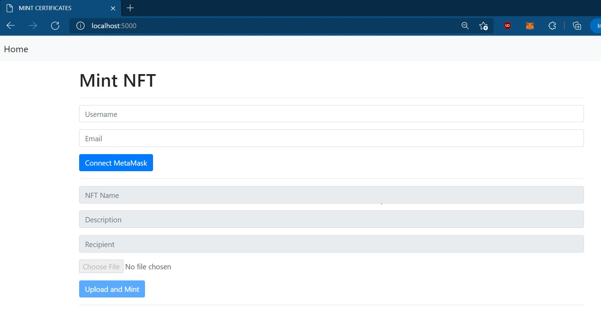
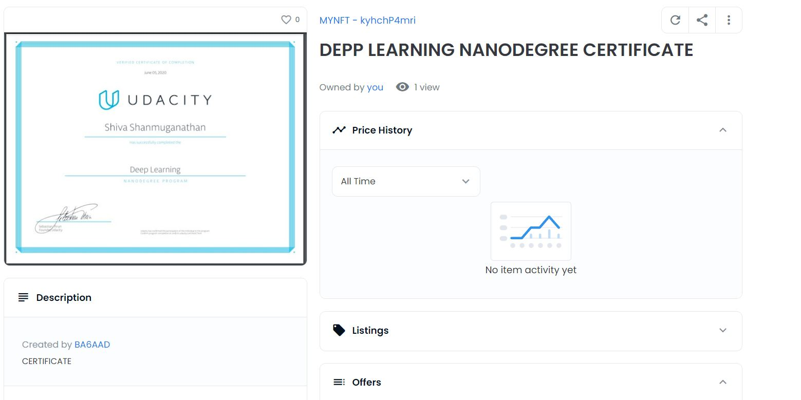

# Non Transferrable NFT Minting Dapp






## Instructions To Run This Project
Requires python3, if you don't have it there are multiple resources online on how to install it according to your platform.
1. Set a virtual environment using 
    ```
    Python3 -m venv venv
    ```
2. Initialize your virtual environment (For Mac and Linux)
    ``` 
    source venv/bin/activate 
    ``` 
3. Intall the dependencies using 
    ```
    pip install -r requirements.txt
    ```
4. Enter Application ID and SOURCE_URL of Moralis Server in the `/app/static/js/logic.js` file
5. RUN `python run.py` to run the Flask Application
6. You can replace the Contract address in `logic.js` to your contract address


